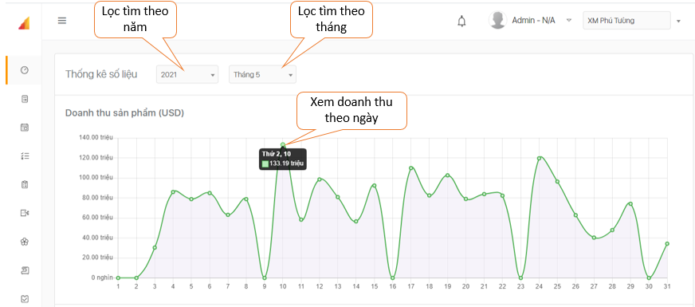
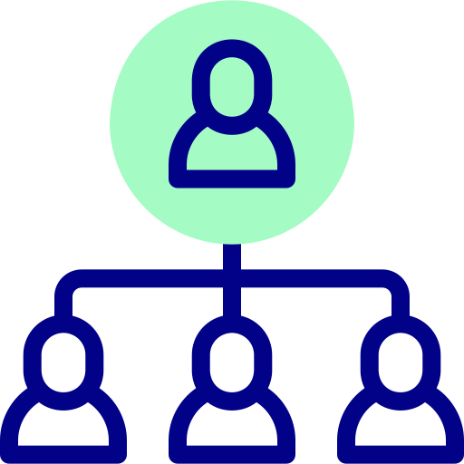
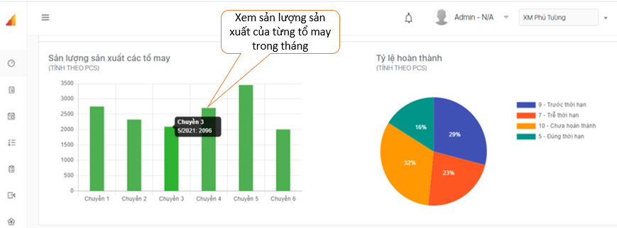
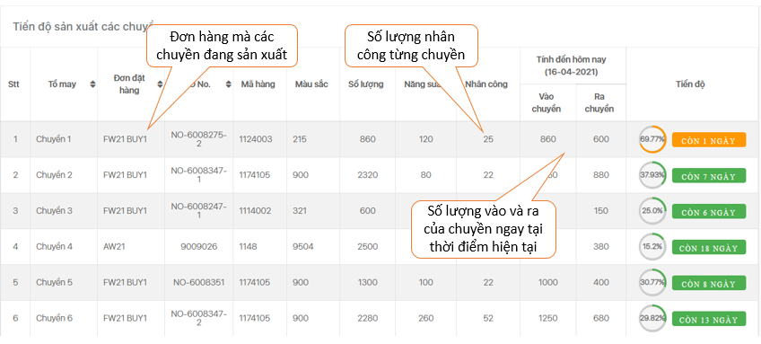
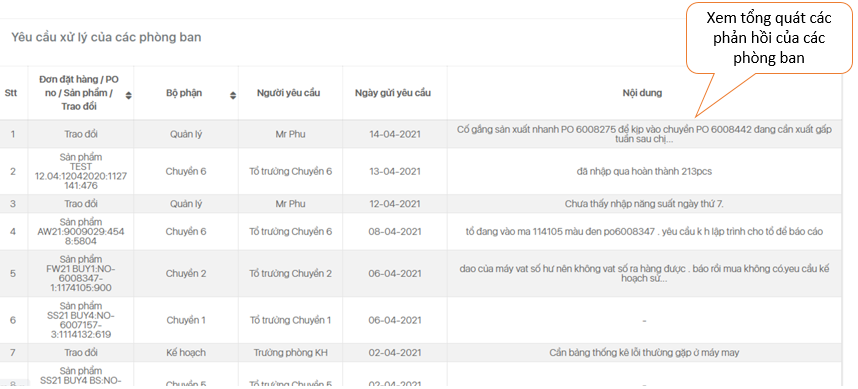
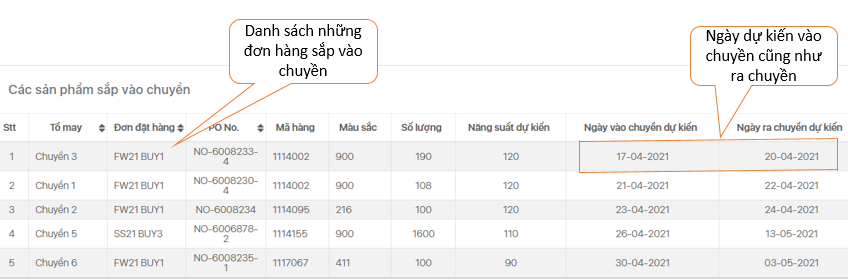

# Bảng điều khiển

1. **Giao diện web**.

 Xem được doanh thu chi tiết từng ngày hoặc từng tháng, tiến độ và năng suất sản xuất của từng chuyền may.


  Ngoài ra, tại bảng điều khiển có thể kiểm tra được “Yêu cầu xử lý của các phòng ban”, tiến độ sản xuất của từng dòng sản phẩm ở các chuyền tương ứng cùng với “Top 5 đơn hàng đã trễ hoặc sắp đến hạn” để dễ dàng theo dõi, đôn đốc các bộ phận xử lý kịp thời gian quy định.

2. **Giao diện trên ứng dụng điện thoại**.

|  |  |
| :--- | :--- |
|    |    |

