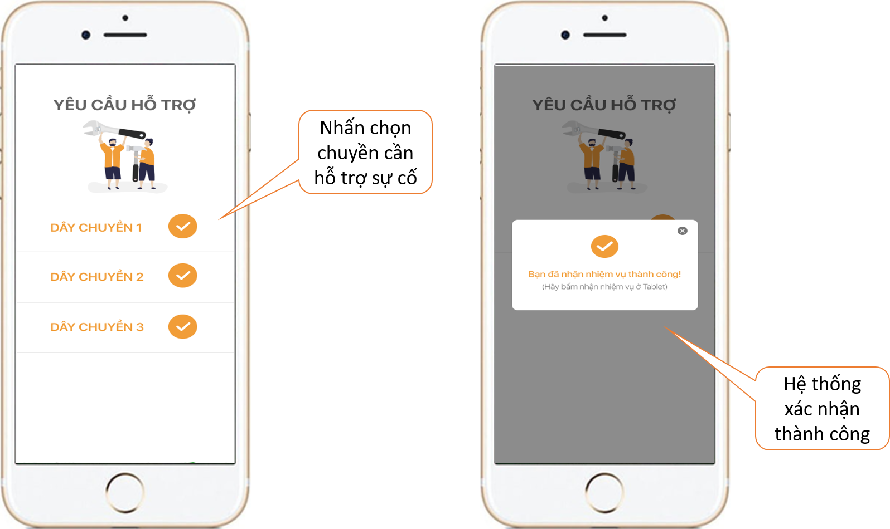
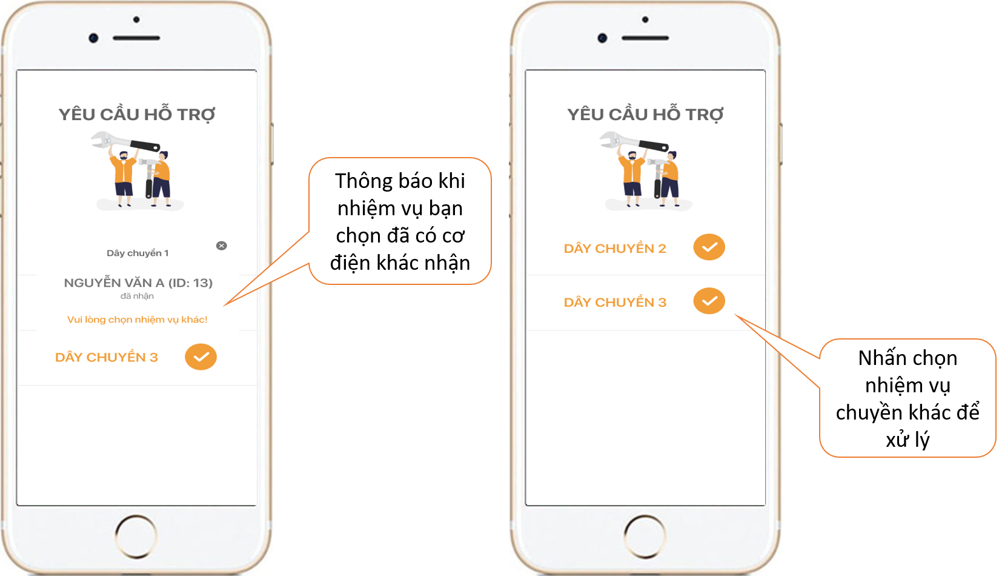

# Hướng dẫn sử dụng trên điện thoại

 Yêu cầu hỗ trợ từ các chuyền sẽ được thông báo đến điện thoại của Cơ điện. Việc của bạn là nhấn chọn vào chuyền mình nhận hỗ trợ ở trên điện thoại. Hệ thống sẽ gửi xác nhận thành công.

 Trong trường hợp nhiệm vụ bạn chọn đã có Cơ điện khác nhận, hệ thống sẽ gửi thông báo và yêu cầu bạn chọn nhiệm vụ khác. 

