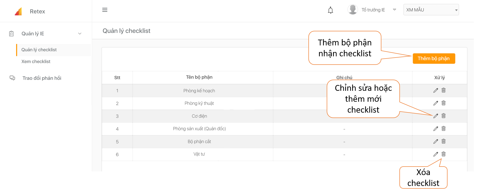
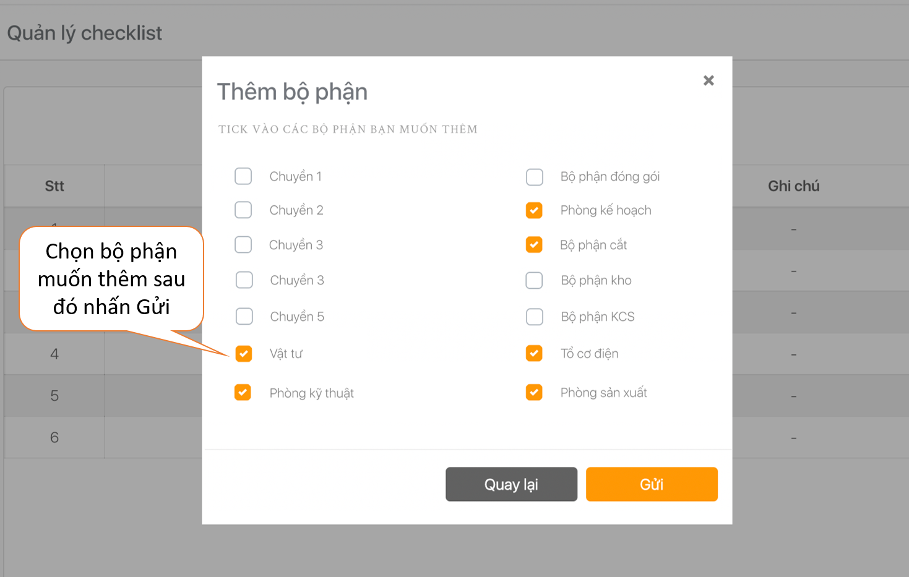
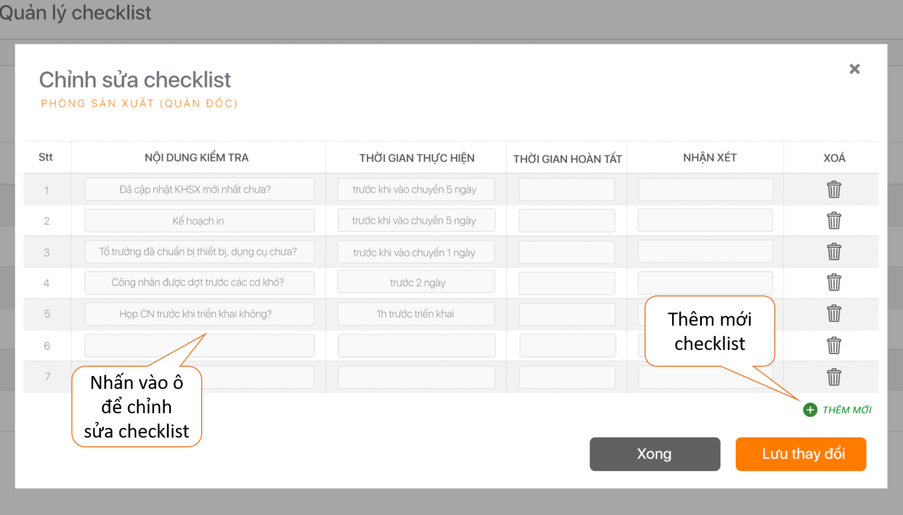

# Quản lý checklist

 Khi cần chỉnh sửa hay thêm mới checklist, bạn rê chuột đến mép trái màn hình, nhấn chọn mục "Quản lý checklist". Tại đây, bạn chọn " Thêm bộ phận" nếu muốn thêm bộ phận nhận checklist. 

 Tích chọn bộ phận và nhấn nút "Gửi" để hoàn tất.

 Trong phần "Chỉnh sửa checklist, bạn có thể Chỉnh sửa hoặc thêm mới checklist sau đó bấm "Lưu thay đổi" để hoàn tất thao tác.

