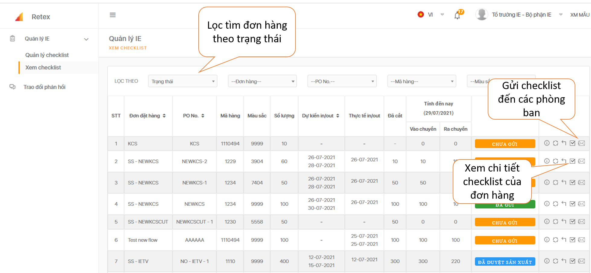
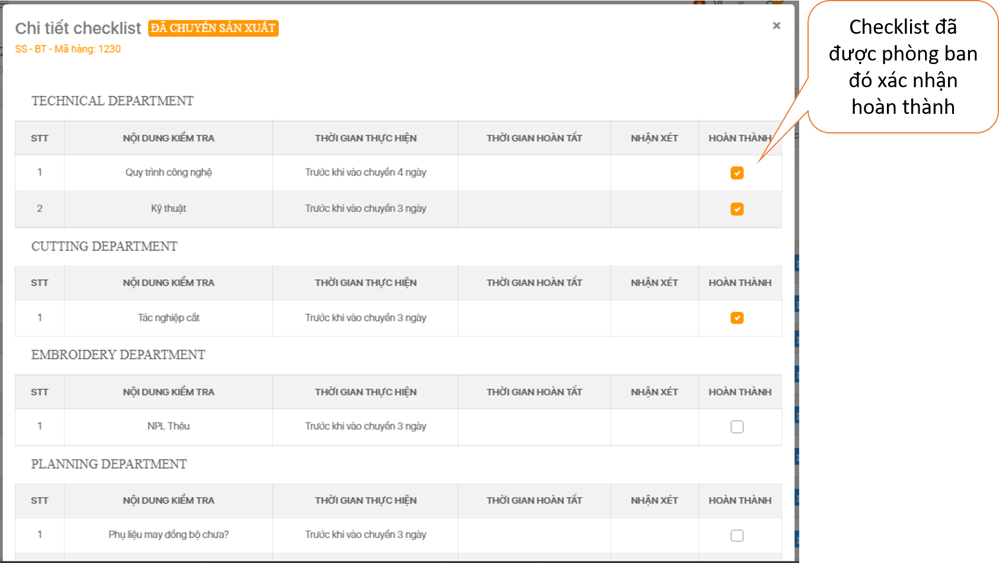
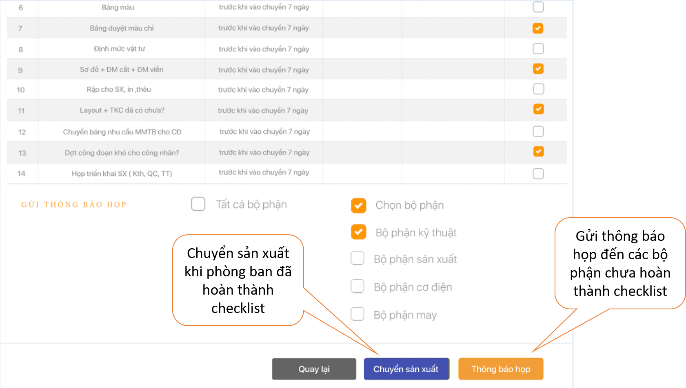
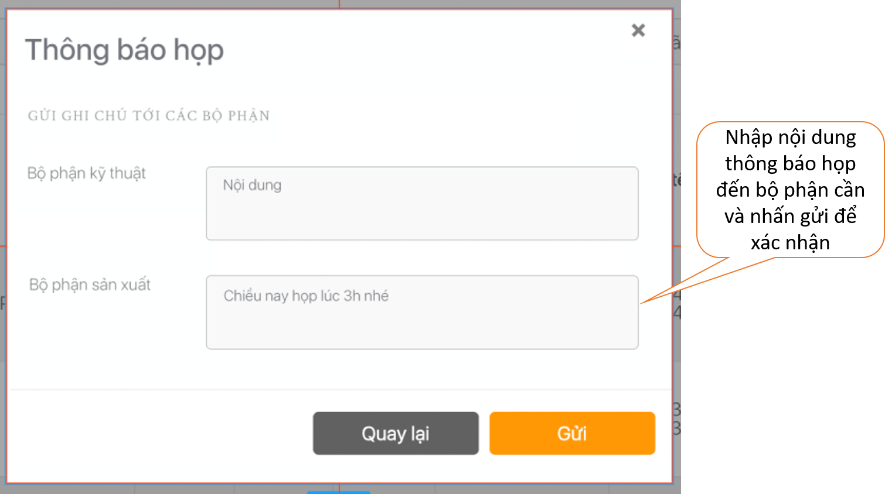

# Xem checklist

 

 Để gửi checklist đến các phòng ban, bạn rê chuột sang mép trái màn hình, chọn mục " Xem checklist". Nhấp chọn vào buổi tượng ở cuối dòng. 

 Nhấp chọn biểu tượng  để xem chi tiết checklist và nếu các phòng ban xác nhận hoàn thành, bạn tiến hành chuyển sản xuất.

 Thông báo họp sẽ được gửi đến phòng ban liên quan.

