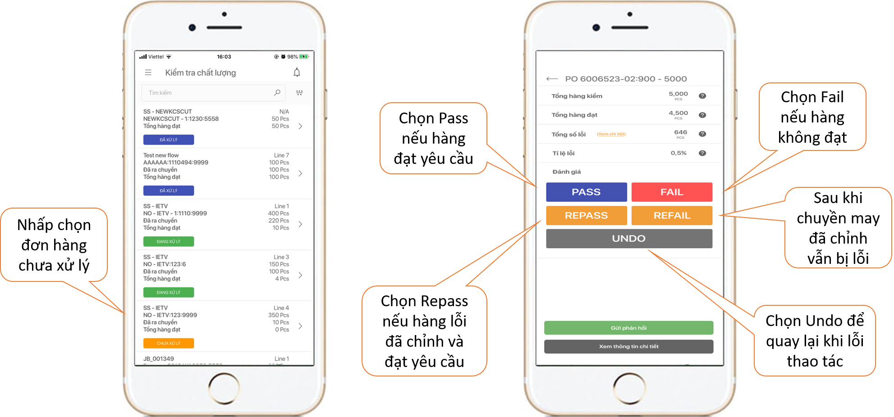

# Hướng dẫn sử dụng trên điện thoại

 Sau khi đăng nhập bằng tên và mật khẩu đã được cung cấp, màn hình ứng dụng sẽ hiển thị danh sách các đơn hàng. Bạn hãy chọn những đơn hàng Chưa xử lý hoặc Đang xử lý.

 Tại màn hình chính hiển thị chi tiết Tổng số hàng kiểm, tổng hàng đạt và hàng lỗi cùng các nút chức năng. Việc của bạn là chọn nút chức năng tương ứng để sử dụng.

 Nếu hàng kiểm không đạt yêu cầu, bạn nhấn chọn nút , chọn vị trí và dạng lỗi. Trong trường hợp lỗi bạn kiểm chưa có trong danh sách hãy chọn  để thêm.

