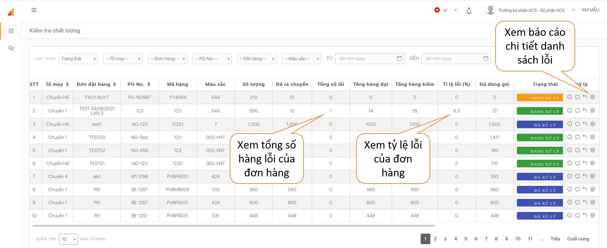
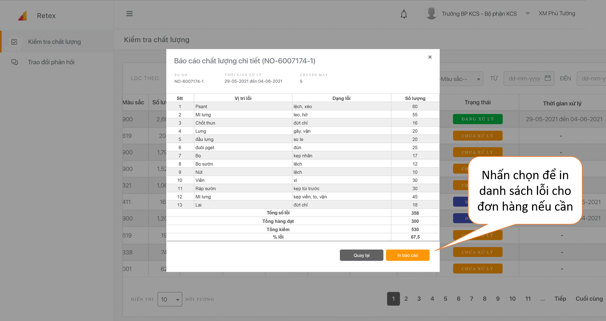

# Kiểm tra chất lượng

 Sau khi đăng nhập, tại màn hình chính bạn có thể xem được số lượng và tỷ lệ lỗi của từng đơn hàng.

 Nếu bạn muốn xem báo cáo chi tiết danh sách lỗi của đơn hàng, bạn nhấp chọn biểu tượng  Bạn cũng có thể in danh sách lỗi của Đơn hàng nếu cần.

