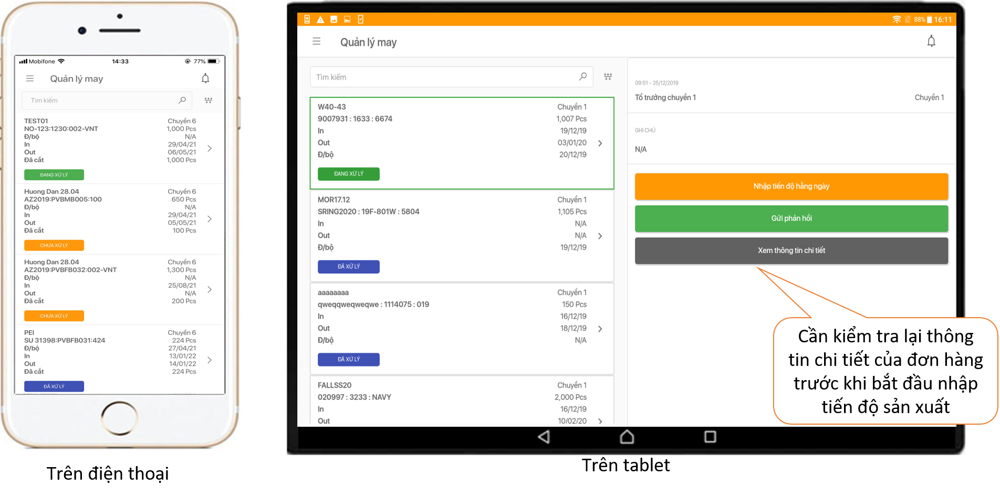
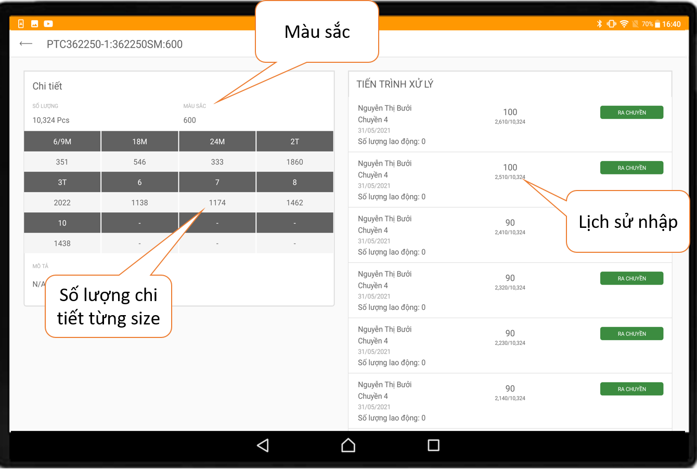
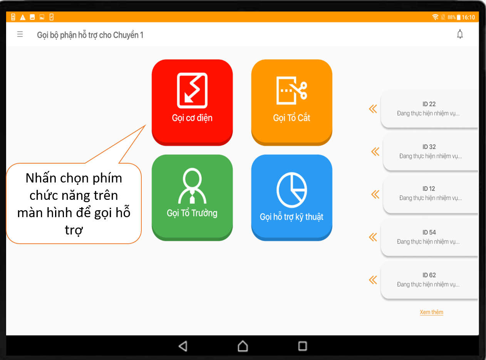
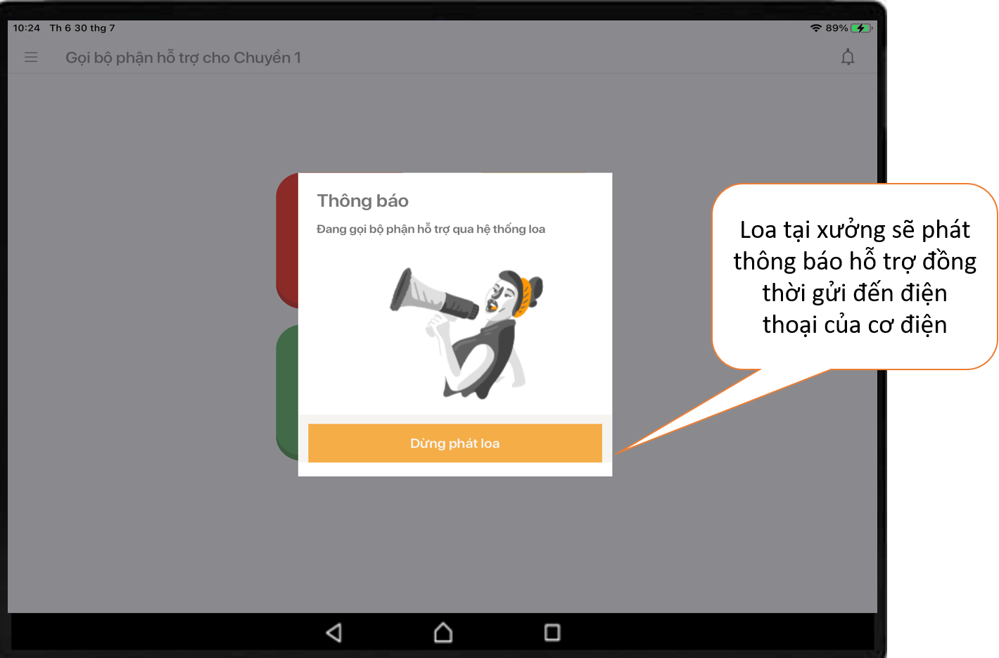
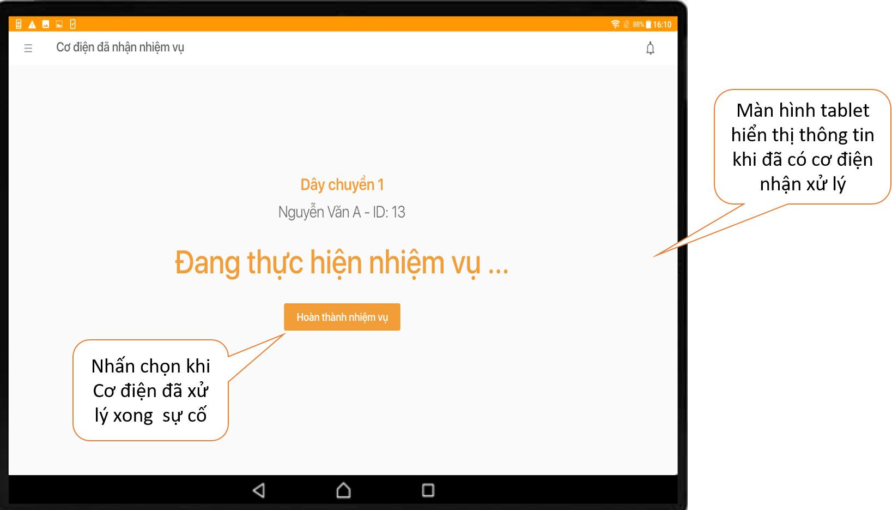
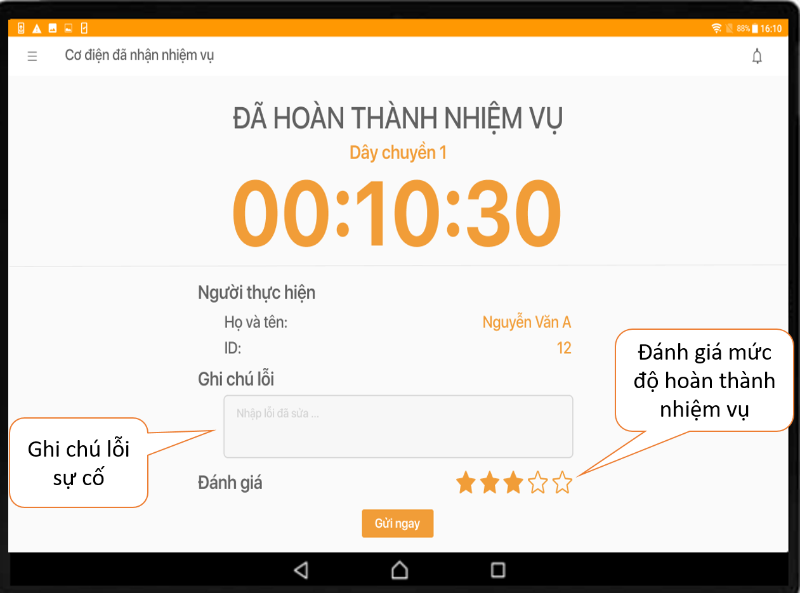

# Hướng dẫn tablet

 Có thể cập nhật tiến độ sản xuất ngay trên Điện thoại hoặc Bảng điều khiển\( Tablet\) tại Xưởng.

 Khi cần hỗ trợ, Chuyền may có thể thao tác trên Tablet ngay tại Xưởng thông qua 4 phím chức năng trên màn hình.

 Loa tại Xưởng lập tức phát thông báo cho bộ phận liên quan xử lý. Đồng thời thông báo sẽ được hệ thống gửi đến điện thoại Cơ điện.

 Sau khi Cơ điện đã nhận nhiệm vụ trên điện thoại, trên tablet tại chuyền may sẽ hiển thị màn hình bên dưới. Đồng thời hệ thống bắt đầu tính thời gian.

 Bạn nhấn chọn vào ô "Hoàn thành nhiệm vụ" khi cơ điện đã xử lý xong sự cố. Đừng quên ghi lỗi và đánh giá sao về mức độ hoàn thành nhiệm vụ bạn nhé.

