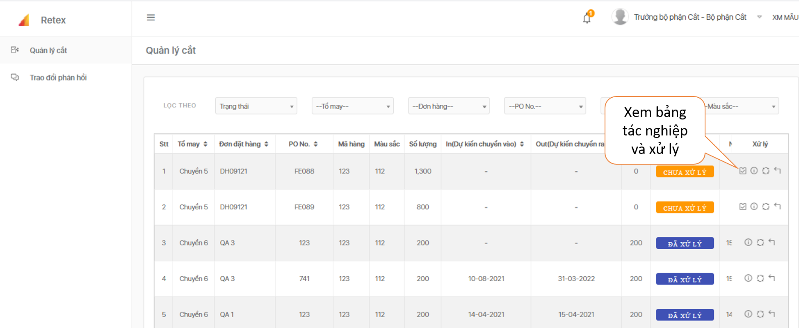
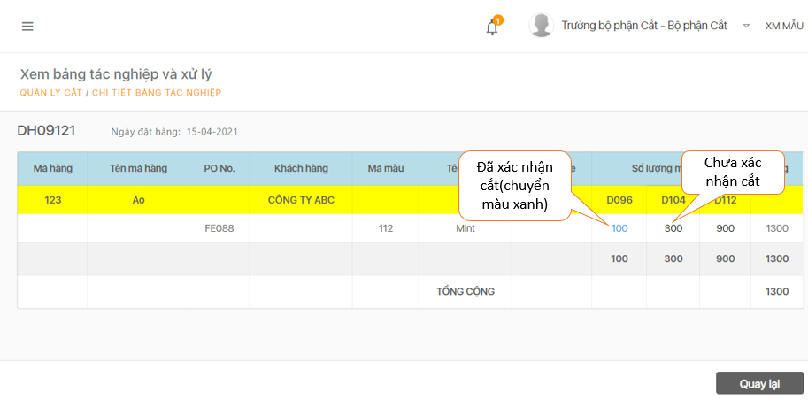
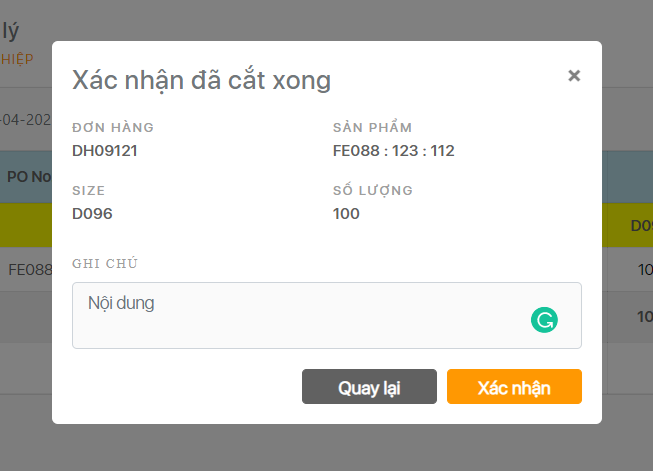

# Quản lý cắt

  Đối với ĐH **chưa xử lý** được chuyển từ bộ phận kỹ thuật sang, click vào “  ” tiến hành xác nhận số lượng cắt cho từng ĐH.


  Click vào số lượng mỗi size, nhập số lượng cắt thực tế và nhấn **Xác nhận.**

