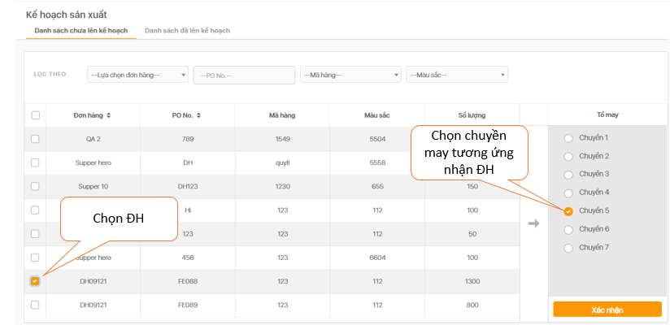
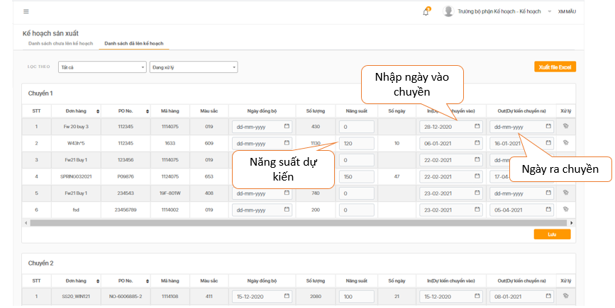
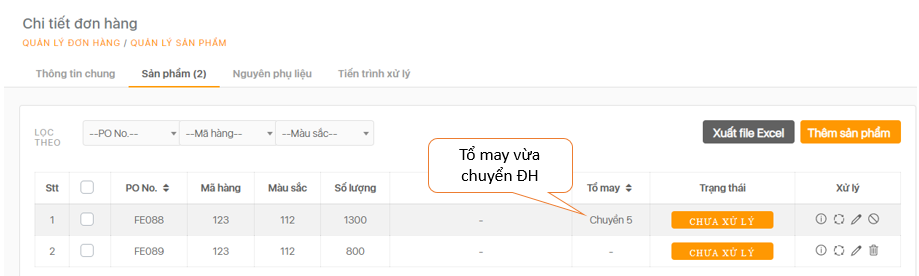
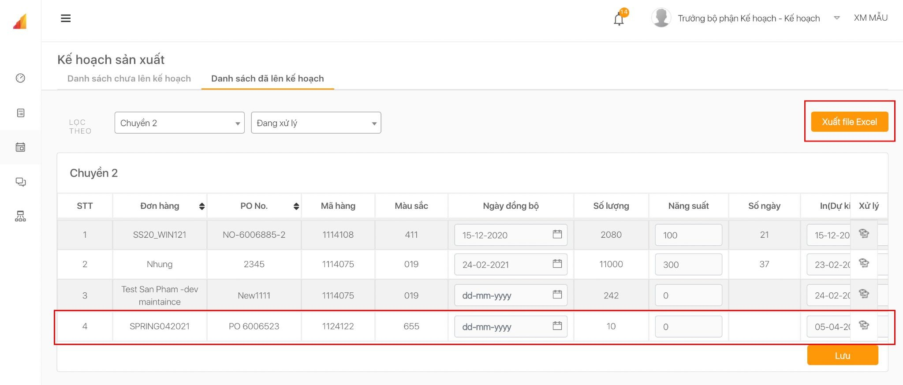

# Kế hoạch sản xuất

 Tại “**Danh sách chưa lên kế hoạch**”, chọn Đơn hàng muốn bàn giao cho Tổ may rồi bấm Xác nhận. Ví dụ, chọn đơn hàng vừa tạo là **ĐH09121**- giao cho chuyền **5**.


   Tại **Danh sách đã lên kế hoạch** hiển thị danh sách các đơn hàng của từng chuyền, giúp dễ dàng tìm kiếm ĐH đang sản xuất ở chuyền nào.


  Muốn kiểm tra lại, về lại Quản lý Đơn hàng, chọn “**Xem chi tiết đơn hàng**” của Đơn hàng vừa bàn giao Tổ may sẽ thấy hiển thị Chuyền may nhận xử lý.


  Phòng kế hoạch có thể xuất file kế hoạch sản xuất của nhà máy tại ô **“Xuất file Excel”.**

