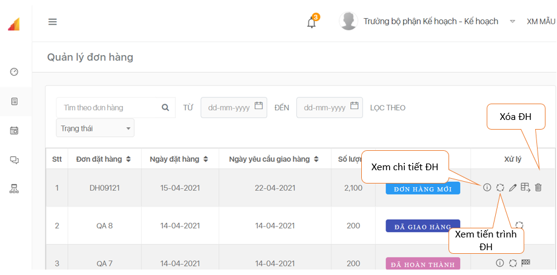
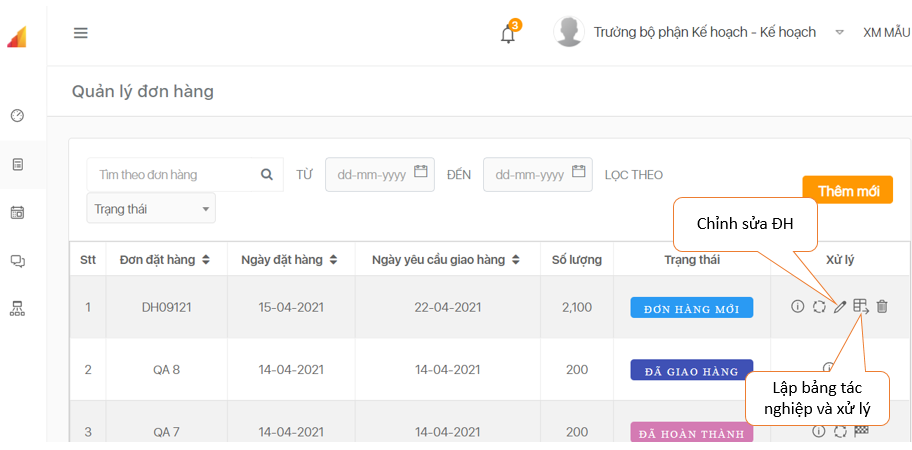
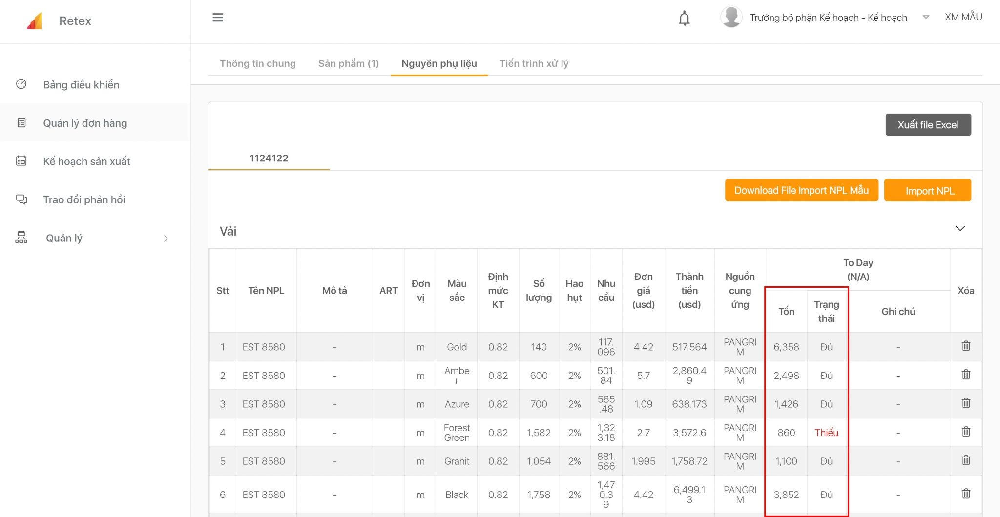
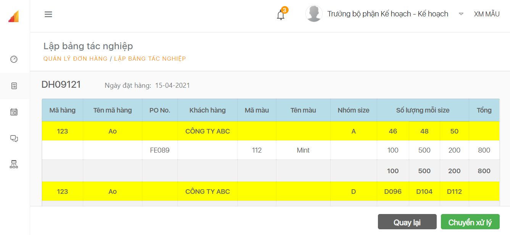
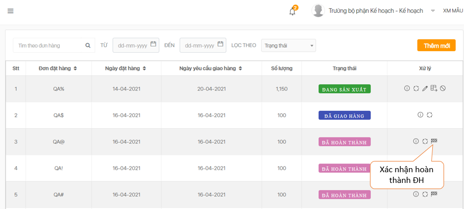

# Quản lý đơn hàng


  Click chọn **Quản lý Đơn hàng**  xuất hiện trang Quản lý.

 Nhấp chọn biểu tượng "**Chỉnh sửa đơn hàng**" 


  Click cột **Nguyên phụ liệu**: tại trang này có thể tải file nguyên phụ liệu mẫu, thêm mới nguyên phụ liệu theo từng mã hàng, xuất file excel bảng cân đối nguyên phụ liệu theo từng đơn hàng. Hệ thống sẽ tự cân đối với kho để thông báo tình trạng từng nguyên phụ liệu trong đơn hàng.

 

 Xem **tiến trình xử lý** của từng đơn hàng

 Vào biển tượng "**Xem bảng tác nghiệp và xử lý"** để "Chuyển xử lý" đơn hàng sang bộ phận tiếp theo.

 
Những ĐH sau khi đã hoàn thành đóng gói thì nhấn biểu tượng lá cờ để xác nhận hoàn thành đưa đi giao hàng. Lúc này ĐH sẽ chuyển trạng thái “**Đã giao hàng**”.

