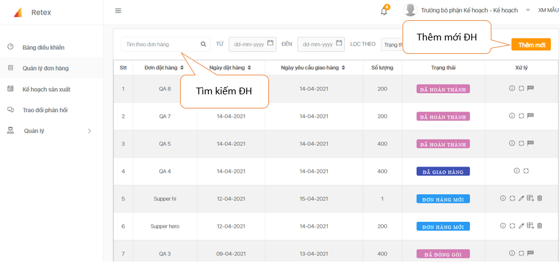
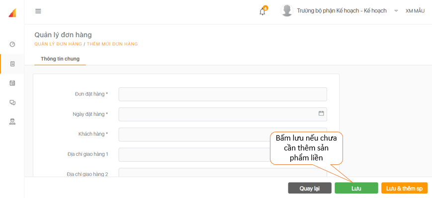
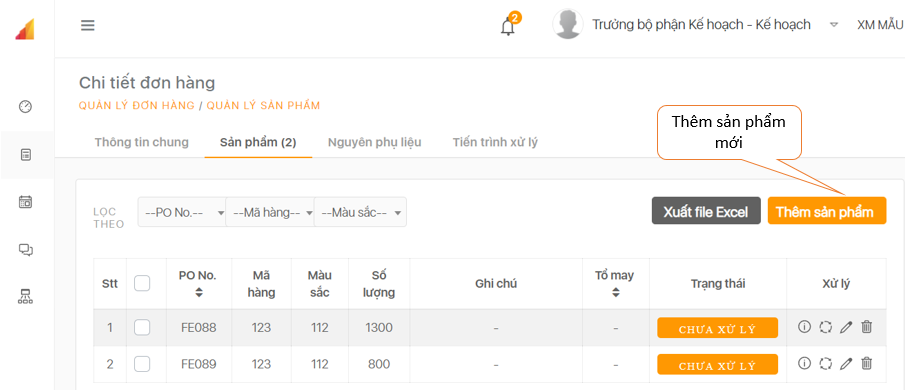

# Tạo lập đơn hàng

```text
Bước 1: Click nút “Thêm mới” góc phải màn hình
```



```text
Bước 2: Xuất hiện khung nhập thông tin ĐH, điền đầy đủ theo hướng dẫn và chọn “Lưu và thêm SP” hoặc chọn “Lưu” (nếu chưa cần thêm SP lập tức).
```



```text
Bước 3: Trong Chi tiết ĐH click nút “Thêm sản phẩm”.
```



```text
Bước 4: Nhập đầy đủ thông tin và chọn “Lưu”.
```


