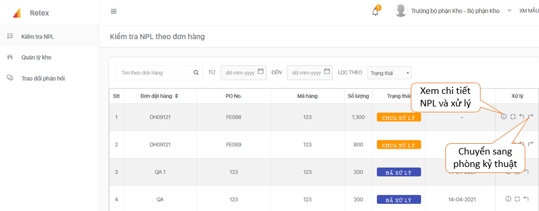
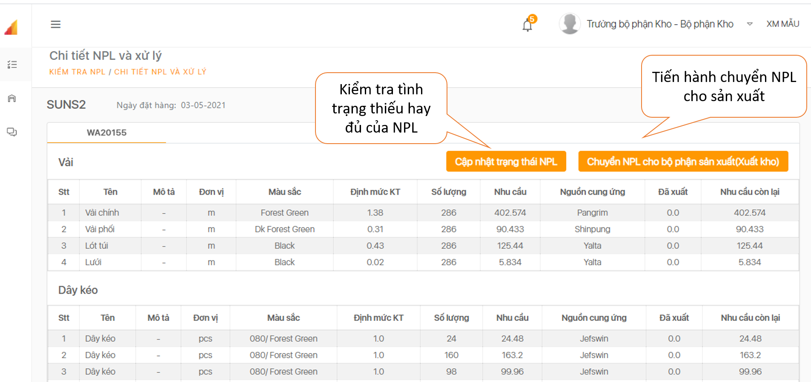
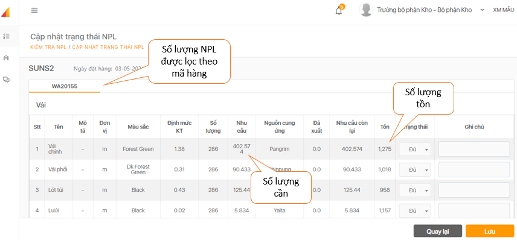
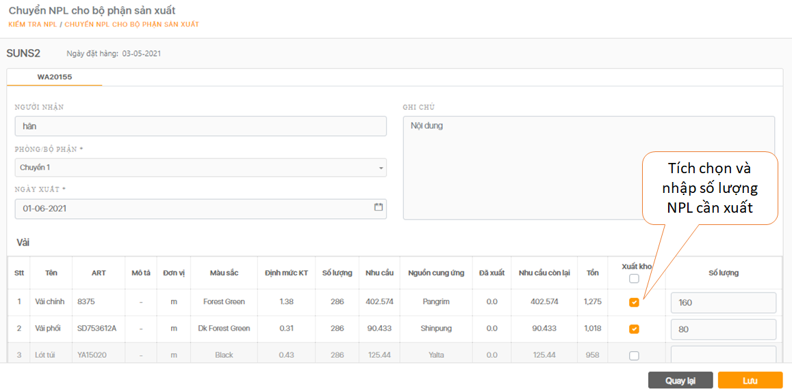

# Kiểm tra NPL

>  Khi Đơn hàng đã chính xác các thông tin thì Bộ phận Kho có thể bấm chuyển qua Bộ phận Kỹ thuật. Lúc này, đơn hàng sẽ chuyển trạng thái thành “**Đã xử lý**”.

>  Kiểm tra chi tiết NPL và xử lý.

>  Kiểm tra tình trạng nguyên phụ liệu.

>  Sau khi kiểm tra trạng thái từng nguyên phụ liệu, tiến hành chuyển cho bộ phận sản xuất.

