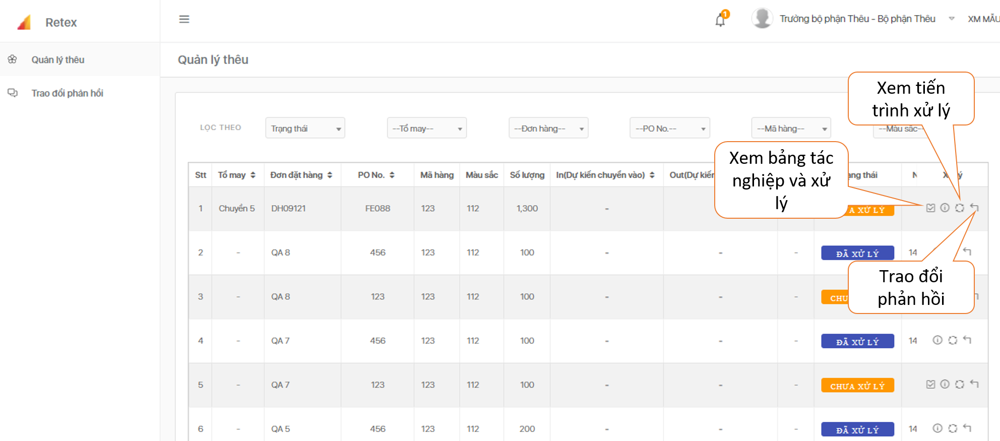

# Quản lý thêu

 Đối với ĐH **chưa xử lý** được chuyển từ bộ phận Cắt sang, click vào “ **Xem bảng tác nghiệp và xử lý**”, tiến hành xác nhận số lượng thêu cho từng ĐH.

 Click vào số lượng mỗi size và nhấn xác nhận

