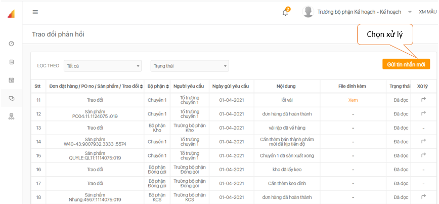
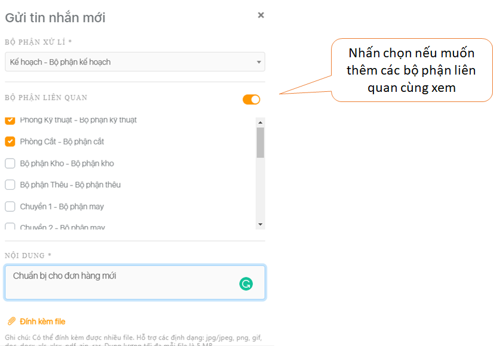

# Trao đổi phản hồi

1. **Hướng dẫn tạo tin nhắn thông báo**.

```text
Bước 1: Vào mục trao đổi phản hồi, clip chọn ô "Gửi tin nhắn mới".
```



```text
Bước 2: Nhập nội dung thông báo, chọn Bộ phận xử lý và gắn thêm các bộ phận liên quan(nếu có).
```



```text
Bước 3: Bấm "Xác nhận" để hoàn tất thao tác.
```

>  Lưu ý: 
 Tất cả các bộ phận đều sử dụng được tính năng “ **Trao đổi phản hồi**”. Để đọc và xử lý phản hồi, phải **đăng nhập** đúng tài khoản của bộ phận nhận phản hồi.

2. **Hướng dẫn xem và xử lý thông báo.**

